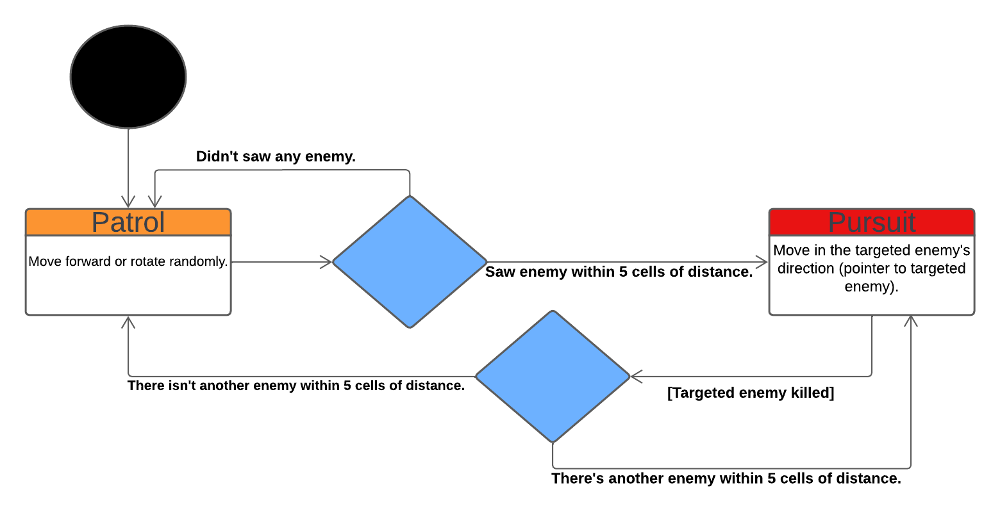
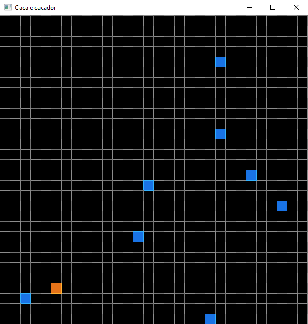

# Caça e Caçador
Made by Filipe Rubin and Felipe Brocker.

Caça e Caçador (**Hunt and Hunter** in english) is a simple OpenGL project containing simple concepts about Artificial Intelligence and State Machines.

# Diagram


# Technical breakdown
The scenario of the simulation is made out of a 30x30 cell grid where each cell contains a pointer. This pointer can be a `nullptr` (empty cell) or a valid pointer to an object of type `Entity`.
```C++
Entity* grid[30][30]; // Entity pointer two-dimensional array

for (int i = 0; i < 30; i++) // Initializing each cell with nullptr
{
    for (int j = 0; j < 30; j++)
    {
        grid[i][j] = nullptr;
    }
}
```

`Entity` is an abstract class that is inherited by `Prey` and `Hunter`, which are both antagonists in our simulation.

```C++
class Entity
{
protected:
    int m_x, m_y;
public:
    static GLuint s_vao;
    static GLint  s_uniformPos;
    static GLint  s_uniformColor;
public:
    static void Load(GLuint vao, GLint uniformPos, GLint uniformColor);
    Entity(int x = 0, int y = 0);
    void GetPosition(int* x, int* y) const;
    void SetPosition(int x, int y);
    virtual void Render() const = 0;
    virtual void Move(Entity* grid[30][30]) = 0;
};
```

### Prey
The prey is a type of Entity that moves to one of the 8 neighbor cells (if available). It has a 10% chance to move away from the hunter and 90% chance to move randomly (even away from the hunter, if lucky) making it appear random but evasive at the same time.
It also contains a member variable to check if it's alive or not. As all of the preys will be stored in the same array later, it's preffered to not be deleted from memory when dead, we'd rather just stop rendering and interacting as we'll free up the memory when the application reaches the end.
```C++
class Prey : public Entity
{
private:
    bool m_alive;
public:
    static unsigned int s_aliveCount;
    static Hunter* s_pHunter;
public:
    Prey(int x = 0.0f, int y = 0.0f);
    void Render() const override;
    void Move(Entity* grid[30][30]) override;
    void Die();
};
```

### Hunter
The hunter has the goal to hunt all of the preys. It contains a state machine and has an unique way of moving, As for the state machine, it contains only two states: `STATE::PATROL` and `STATE::MOVING`:
* `STATE::PATROL` is bound when there's no prey at the hunter's sighting range. Each step the hunter rotates or moves randomly.
* `STATE::PURSUE` is bound when `m_pTarget != nullptr`. Each step the hunter moves in the direction of the targeted prey.

When the hunter detects a prey on one of the 8 neighbor cells, it kills it instantly no matter the current state.
```C++
class Hunter : public Entity
{
private:
    enum class DIRECTION
    {
        UP, DOWN, LEFT, RIGHT
    };

    enum class STATE
    {
        PATROL, PURSUE
    };
private:
    DIRECTION m_direction;
    STATE     m_state;
    Prey*     m_pTarget;
private:
    void Walk(Entity* grid[30][30]);
    void Rotate();
    void CheckSurroundings(Entity* grid[30][30]);
    void CheckForPrey(Entity* grid[30][30]);
    void PursuePrey(Entity* grid[30][30]);
public:
    Hunter(int x = 0, int y = 0);
    void Render() const override;
    void Move(Entity* grid[30][30]) override;
};
```

# Simulation start, loop and finish
When the simulation starts, the hunter is instantiated and bound to a random location in the grid. After that, all of the preys are dynamically created (as there are 5 to 10 preys, the compiler can't know how much) and then bound to a random location in the grid, always avoiding to be placed in the same cell as the hunter or its prey mates.

When the application enters the main loop, it waits for 3 seconds and then the simulation begins, counting each movement as a "step" and storing the total amount of steps in a variable named `stepCount`. Every 0.2 seconds, a new step occurs (can be tweaked in code). Each step calls `Entity::Move()` on every entity and each frame (independent of steps) calls `Entity::Render()` on every entity.

When every prey is hunt, the simulation ends its loop and a little window shows up informing the user about the `stepCount`.

# Final result


# How to setup
If you are using Visual Studio 2019, you can just execute the solution file. If you are using any other version of Visual Studio, just make sure to change the `Platform Toolset` and `Windows SDK Version` to the appropriate versions.

If you are using any other compiler, make sure to compile all of the source files contained on the [Source](Caca-e-Cacador/Source) folder, include the headers on the [include](Caca-e-Cacador/Dependencies/include) folder and link the libraries on the [lib](Caca-e-Cacador/Dependencies/lib) folder.

**Make sure to always compile in x86!!!**
